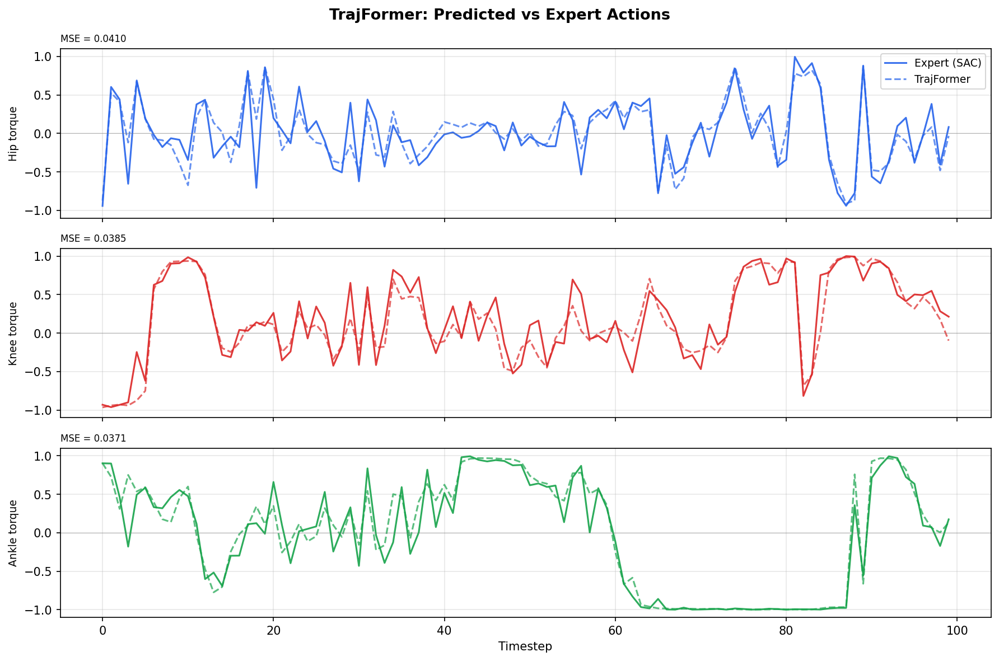
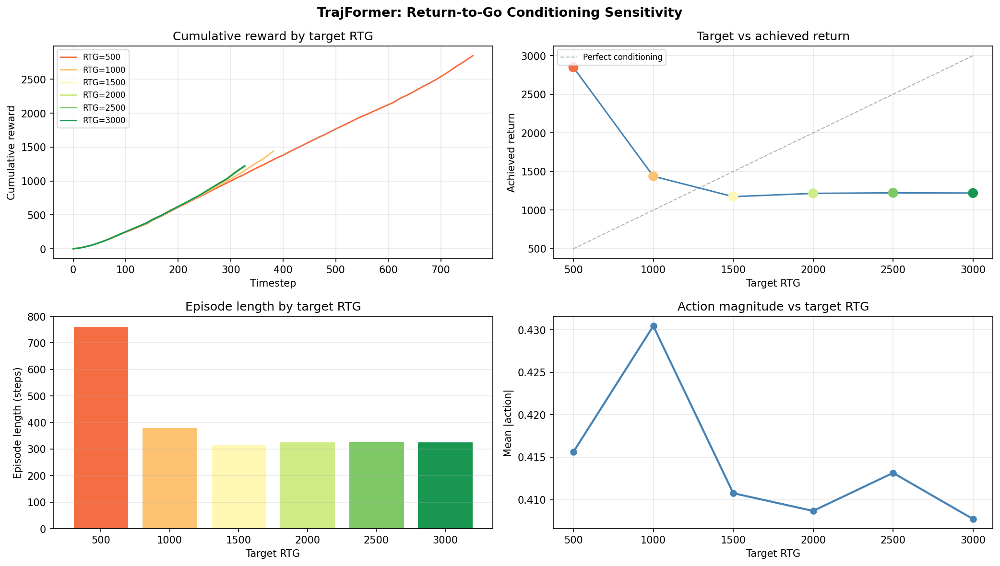
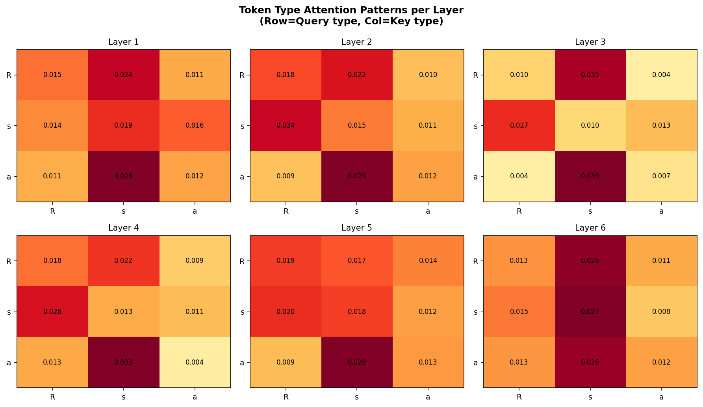
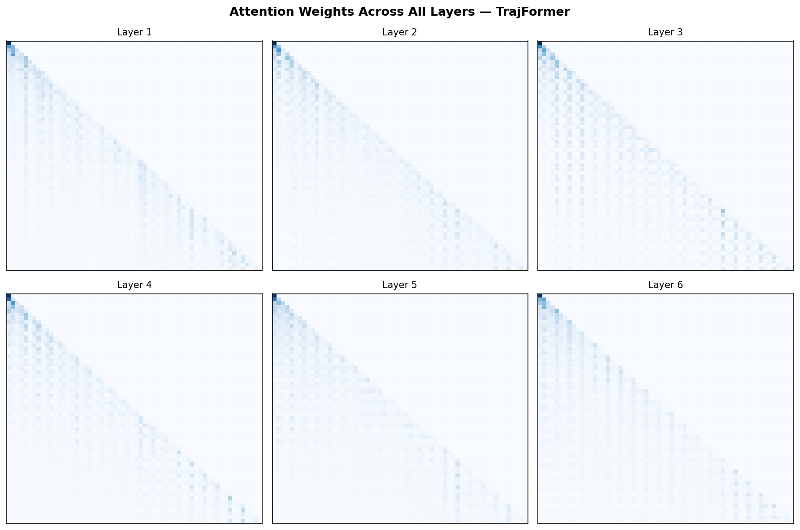

# TrajFormer

A Decision Transformer trained from scratch on a GTX 1050 (4GB VRAM) to control a simulated hopping robot. Attention, positional encoding, and transformer blocks are written from scratch.

---

## What This Is

Decision Transformer (Chen et al. 2021) reformulates robot control as sequence modeling. Instead of learning a value function or a policy gradient, the model learns to predict actions conditioned on a desired return-to-go — essentially, you tell it how well you want it to perform, and it figures out the actions that historically led to that outcome.

The input sequence looks like this:

```
(R₀, s₀, a₀, R₁, s₁, a₁, ..., R₁₉, s₁₉, a₁₉)
```

Where R is reward-to-go, s is the 11-dimensional Hopper state, and a is the 3-dimensional joint torque command. At inference, set R high — the model produces actions that match that target.

This is the same architectural paradigm behind RT-2, Decision Transformer, and most modern robot foundation models. This project is a minimal, fully transparent implementation of that idea.

---

## Results

| Agent | Mean Return | Mean Episode Length |
|---|---|---|
| Random | 14.7 ± 7.5 | 21 steps |
| **TrajFormer** | **2190.3 ± 1163.7** | **602 steps** |
| Expert SAC | ~3000+ | ~1000 steps |

Evaluated over 20 rollout episodes in Hopper-v4. The model keeps the robot upright and moving forward for 602 steps on average — compared to 21 steps for a random agent.





---

## Benchmarks

| Metric | Value |
|---|---|
| Model size | 5.1 MB |
| Training peak VRAM | 332.5 MB (8.1% of 4GB) |
| Single inference latency | 4.87 ms |
| Max inference rate | 205 Hz |
| Throughput | 2,593 samples/sec |
| Latency breakdown | Transformer 89.5%, Embedding 9.2%, Head 4.5% |

205 Hz exceeds the control frequency of most real-time robot controllers. The transformer accounts for 89.5% of inference time — the expected bottleneck for attention-based architectures.

---

## What The Attention Learns

The token type attention patterns across all 6 layers show a consistent signal: **action tokens attend most strongly to state tokens**. The a→s attention dominates in every layer, peaking at 0.039 in layer 3.

This is physically correct. To predict joint torques, the model looks at joint positions and velocities — the state. It learned this structure from data, not from any hardcoded inductive bias.



The causal mask holds perfectly across all layers — clean lower-triangular structure, no future token leakage.



---

## Architecture

```
(R, s, a) sequences
      ↓
TrajFormerEmbedding
  - Linear projections: R→D, s→D, a→D
  - Sinusoidal positional encoding (fixed)
  - Learned timestep embedding (shared across R,s,a at same t)
  - Interleaved token sequence: (R₀, s₀, a₀, R₁, s₁, a₁, ...)
      ↓
TransformerDecoder — 6 layers
  Each block (pre-norm / GPT-style):
    x = x + MultiHeadAttention(LayerNorm(x))   ← causal, 8 heads
    x = x + FFN(LayerNorm(x))                  ← GELU, 4× expansion
      ↓
Action head: state token representations → predicted actions
  Linear → GELU → Linear → Tanh
  Output clipped to [-1, 1] (Hopper action range)
```

| Parameter | Value |
|---|---|
| D_MODEL | 128 |
| N_HEADS | 8 |
| N_LAYERS | 6 |
| D_FF | 512 |
| Context length K | 20 timesteps (60 tokens) |
| Trainable parameters | 1,334,275 |

Everything in `core/` is written from scratch. 

---

## Training

**Dataset:** 500 mixed-quality episodes — 200 expert (top 200 filtered from 400 collected), 200 medium, 100 random. 200,217 total transitions. Return range 5–3659 across three tiers.

**Objective:** MSE between predicted and actual actions (behavior cloning).

**Schedule:** Linear warmup (500 steps) → cosine decay. AdamW, lr=1e-4, weight_decay=1e-4. Gradient clipping at 1.0.

**Hardware:** NVIDIA GTX 1050, 4GB VRAM. AMP enabled. ~4 min/epoch.

```
Epoch 001: train=0.0978  val=0.0602
Epoch 006: train=0.0411  val=0.0444
Epoch 013: train=0.0342  val=0.0424  ← best
Epoch 023: train=0.0295  val=0.0436  ← early stop
```

Training completed in ~1.6 hours. No improvement for 10 consecutive epochs triggered early stopping at epoch 23.

---

## Project Structure

```
TrajFormer/
├── core/
│   ├── attention.py      # Scaled dot-product + multi-head attention
│   ├── positional.py     # Sinusoidal PE + learned timestep embedding
│   └── transformer.py    # Decoder blocks + full decoder stack
├── src/
│   ├── model.py          # TrajFormer: full Decision Transformer
│   ├── dataset.py        # Trajectory windows + normalization
│   ├── train.py          # Training loop with sanity checks
│   └── evaluate.py       # Environment rollout evaluation
├── data/
│   └── collect.py        # Mixed-quality trajectory collection
├── analysis/
│   ├── attention_viz.py  # Attention heatmaps + token type patterns
│   └── trajectory_viz.py # Predicted vs actual trajectory plots
├── benchmark/
│   ├── latency_test.py   # Per-stage inference latency
│   └── vram_profiler.py  # VRAM usage profiling
└── config.py             # All hyperparameters in one place
```

---

## Reproducing

```bash
# Install
pip install torch==2.1.0+cu118 torchvision==0.16.0+cu118 \
    --index-url https://download.pytorch.org/whl/cu118
pip install gymnasium[mujoco] stable-baselines3 huggingface-sb3 \
    huggingface-hub shimmy numpy matplotlib tqdm scikit-learn

# Collect mixed-quality data (~15 min)
python data/collect.py

# Train (~2 hours on GTX 1050)
python src/train.py

# Evaluate
python src/evaluate.py

# Visualize attention
python analysis/attention_viz.py
```

---

## RTG Conditioning

The model responds to return-to-go conditioning but not monotonically. RTG=500 produces the best performance (2848 reward, 762 steps) — significantly ahead of higher targets. Performance drops sharply at RTG=1000 then plateaus from RTG=1500 onward at ~1200 reward.

This is a dataset distribution artifact. RTG=500 sits between the random tier (5-100 reward) and medium tier (1000-2000 reward) — a gap the model never saw during training. Queried at this value it defaults to stable learned behavior without being pulled toward out-of-distribution expert actions it cannot reliably execute.

Setting RTG too high (1500-3000) asks the model to reproduce expert trajectories it has seen only 200 times out of 500 episodes. It overreaches and falls over sooner.

The practical finding: for this model and dataset, RTG=500 is the optimal inference target despite the expert tier reaching 3659.

---

## References

- Chen et al. (2021) — [Decision Transformer: Reinforcement Learning via Sequence Modeling](https://arxiv.org/abs/2106.01345)
- Vaswani et al. (2017) — [Attention Is All You Need](https://arxiv.org/abs/1706.03762)
- Fu et al. (2020) — [D4RL: Datasets for Deep Data-Driven Reinforcement Learning](https://arxiv.org/abs/2004.07219)
- Raffin et al. (2021) — [Stable-Baselines3](https://jmlr.org/papers/v22/20-1364.html)
